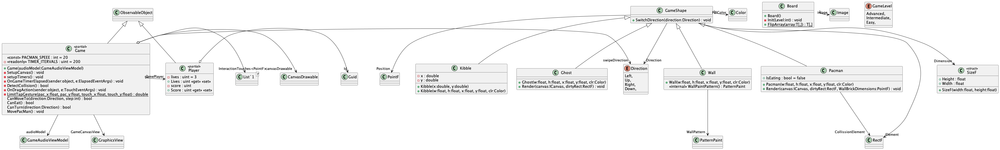
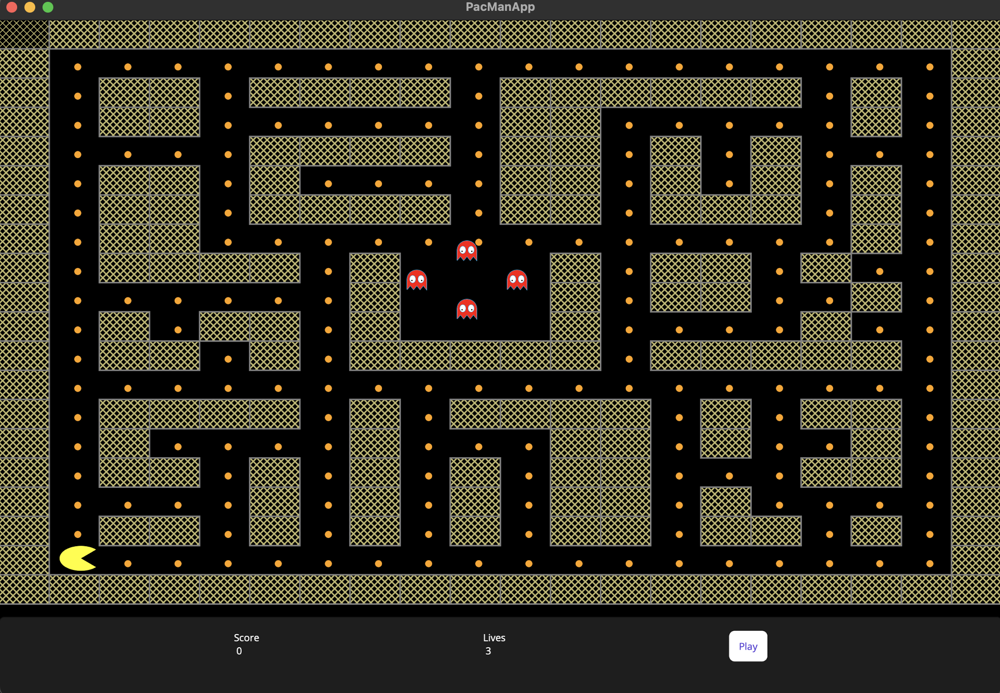

# IA5110001 Programming 2
Assignment 2 – Pacman Game


---
## Propblem Domain

For this assignment, you will recreate the classic arcade game Pacman. In this game, a litle smiley- face (Pacman) travels through a maze eatng kibble. Also in the maze are three ghouls. Pacman’s goal is to consume all the kibble in the maze without running into any of the ghouls. The screen shots below show an example of the simplified version of Pacman required for this assignment. The image on the let shows the start of the game; the image on the right shows the game a�er Pacman has inadvertently run into the light-coloured ghoul.

---

## Solution
Applied Object oriented pattern to segregate concerns between game models/classes. please refer to class diagram.


## Technical Notes
- Used a canvas to draw elements on the game window with pre-defined coordinates and dimensions, all code required for the game to operate does not involve any plain xaml markup but created as code behind style from C#

- Used trigonometry and geometry concepts to layout the desired building blocks to fit any screen size


## Challenges
The game is created with .NET MAUI framework which does not support keydown events out of the box, I had to create the logic. However, I opted for drag events and minimize drag criteria by chosen angels in relation to pacman current position.


``` C#

private static double LimitTapGesture(float pac_x, float pac_y, float touch_x, float touch_y)
{
    double angleRadians = Math.Atan2(pac_y - touch_y, pac_x - touch_x);// get the angle between touch point and pacman rect
    double angleDegrees = angleRadians * (180 / Math.PI); // hollow circle to help decide which way to go!
    var pressed_angle = (angleDegrees + 360) % 360; // normalize
    return pressed_angle;
}

```

 -  --the collision detection algorithm needs more work to handle the fractional conversion between the x,y window pixels and index matrix integers.--


## build and run

```bash
# may need sudo privlige
dotnet workload restore 

dotnet restore

dotnet run


dotnet test # todo

# or with Visual Studio
```


---

# class Diagram$


# Screen Shot



---

### Maintainer : Ahmed A. <ahbox@outlook.com>

### Mentor : Prof. Barry Dowdeswell

### Head of department: Prof. Farhad Mehdipour
### Assets credits
Sounds TMK https://themushroomkingdom.net/


---
