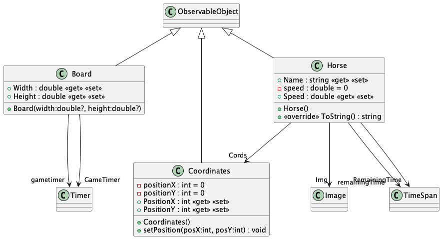

## IX511001 Programming 2 CHECKPOINT 4- Looney Tune Horse Race

---
## build and run

```bash
# may need sudo privlige
dotnet workload restore 

dotnet restore

dotnet run


dotnet test # todo

# or with Visual Studio
```


---

# class Diagram


# Screen Shot


---

### Maintainer : Ahmed A. <ahbox@outlook.com>

### Mentor : Prof. Barry Dowdeswell

---