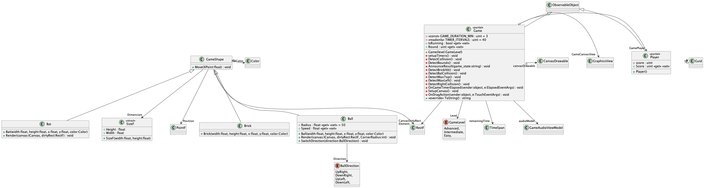
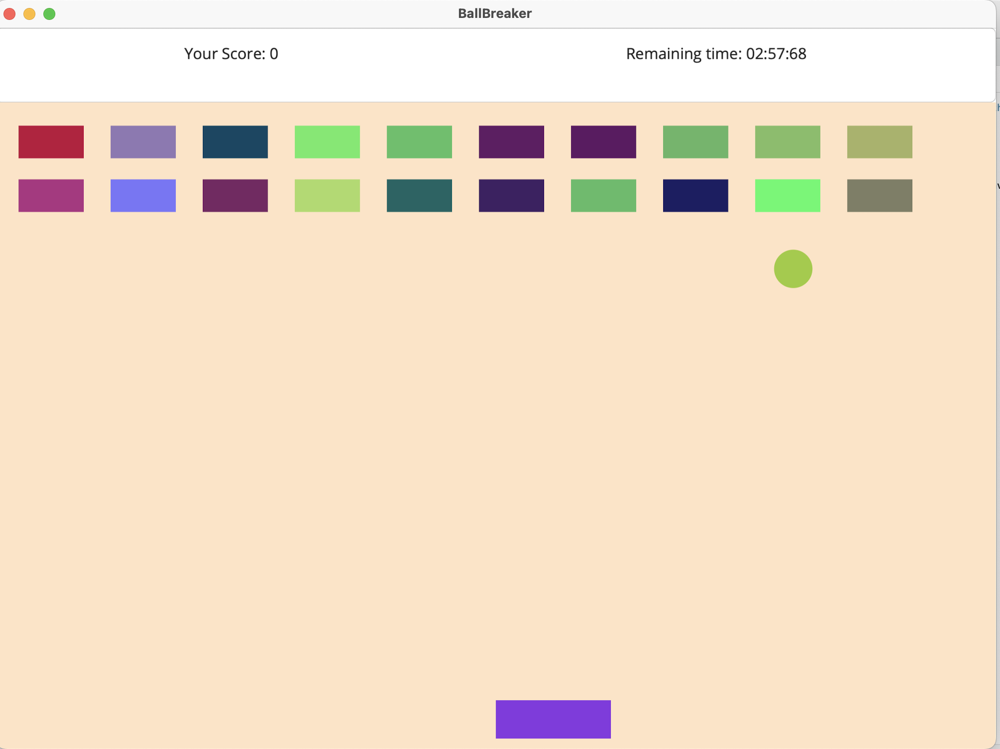


## IA511001 Programming 2 Assignment 1 –Breakout Game


---
## Propblem Domain
### For this assignment, you will create the arcade game “Breakout”, where the user atempts to destroy layers of bricks at the top of the screen with a bouncing ball. The user can move the paddle back and forth across the botom of the screen with the mouse and bounce the ball off the paddle. If the ball misses the paddle and goes off the botom of the screen, the game ends. The ball bounces off the sides of the screen.

## Solution
Applied Object oriented pattern to segregate concerns between game models/classes. please refer to class diagram.

## Technical Notes
Used a canvas to draw elements on the game window with pre-defined coordinates and dimensions, all code required for the game to operate does not involve any plain xaml markup but created as code behind style from C#

## Challenges
The game is created with .NET MAUI framework which does not support keydown events out of the box, I had to create the logic.

---
---
## build and run

```bash
# may need sudo privlige
dotnet workload restore 

dotnet restore

dotnet run


dotnet test # todo

# or with Visual Studio
```


---

# class Diagram


# Screen Shot


---

### Maintainer : Ahmed A. <ahbox@outlook.com>

### Mentor : Prof. Barry Dowdeswell

### Assets credits
Sounds TMK https://themushroomkingdom.net/


---
